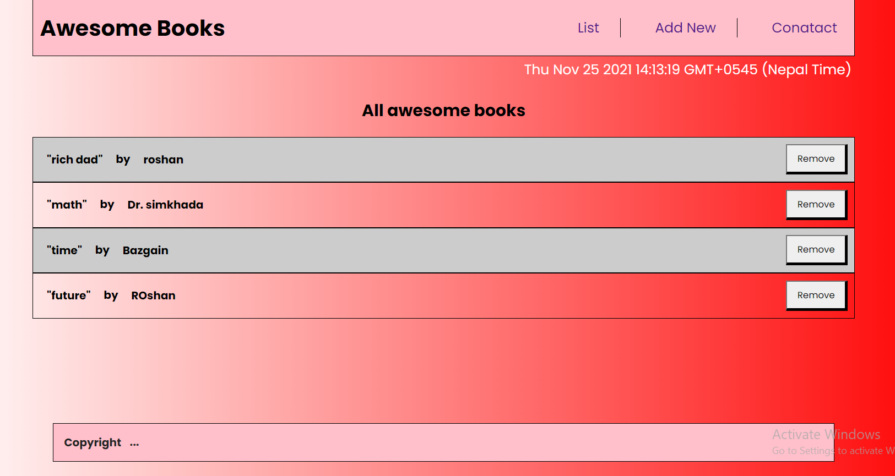

# AwesomeBook

Additional description about the project and its features.

## Built With

- HTML
- CSS
- Javascript

## Getting Started

To get a local copy up and running follow these simple example steps.

### Setup

- Simply clone the project (for more information please check the link https://docs.github.com/en/repositories/creating-and-managing-repositories/cloning-a-repository)
- Run the cmd promt
- Type "npm install" for the dependencies

### Prerequisites

live server vscode extention

### Install

no installations

## LIVE DEMO

[View Live Demo](https://mithi-code.github.io/AwesomeBook/)

## Authors 1

👤 **Roshan Bajgain**

- GitHub: [@roshan-bajgain](https://github.com/roshan-bajgain)
- Twitter: [@RoshanBajgain10](https://twitter.com/RoshanBajgain10)
- LinkedIn: [LinkedIn](https://www.linkedin.com/in/roshan-bazgain/)

 ## Authors 2
 
 👤 **Mithi**

- GitHub: [@githubhandle](https://github.com/Mithi-code)
- Twitter: [@twitterhandle](https://twitter.com/LazyMithlesh)
- LinkedIn: [LinkedIn](https://www.linkedin.com/in/mithlesh-kumar-564a97221/)

## 🤝 Contributing

Contributions, issues, and feature requests are welcome!

Feel free to check the [issues page](https://github.com/Mithi-code/AwesomeBook/issues).

## Show your support

Give a ⭐️ if you like this project!

## Acknowledgments

## 📝 License

This project is [MIT](./MIT.md) licensed.
‣慃獰潴敮ㄭ  
